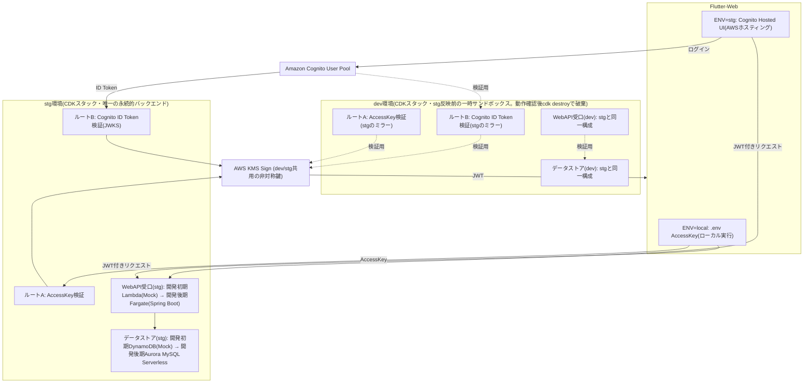
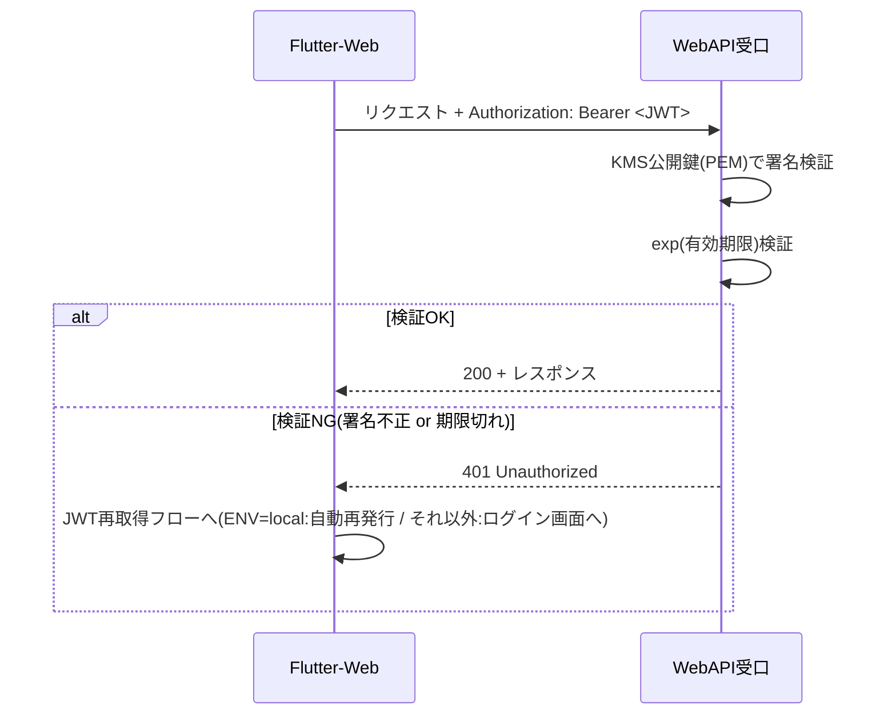

# design.md — 認証基盤(JWT / KMS / Cognito)

## 1. アーキテクチャ概要



ローカル実行のフロントエンド(`ENV=local`)・AWSホスト済みフロントエンド(`ENV=stg`)は、いずれも唯一の永続的バックエンドである **stg環境** に接続する(REQ-107)。dev環境はstg環境への変更反映前にバックエンドを一時的に検証するためのサンドボックスであり、stg環境と同一構成(ルートA・ルートB双方)をミラーするが、通常のフロントエンドからは接続しない。dev環境のルートBは専用のCognito User Poolを持たず、stg用のプールを共用する。KMSキーはdev環境・stg環境で単一のものを共用する(REQ-108)。dev環境は動作確認が完了し次第`cdk destroy`で速やかに破棄し、常時稼働させないことで露出期間を最小化する(REQ-109)。

## 2. 設計方針(トークン交換パターン)

Cognito・AccessKeyのいずれのログイン経路であっても、最終的にWebAPI受口に渡されるトークンは**KMSの非対称鍵で署名した単一形式のJWT**に統一する(トークン交換 / Token Exchangeパターン)。

これにより、WebAPI受口(Spring Boot / Lambda Mock)は発行元の違い(AccessKeyかCognitoか)を意識せず、常に1つの公開鍵で検証すればよい。マルチ発行者(multi-issuer)対応は不要とする。

署名鍵(KMSキー)はdev環境・stg環境で単一のものを共用する(REQ-108)。dev環境はstg環境への変更反映前の一時的な検証用サンドボックスであるため、鍵を分離する必要はなく、両環境で発行されるJWTは互換性を持つ。

## 3. コンポーネント設計

### 3.1 JWT発行基盤(API Gateway + Lambda)

**エンドポイント構成**

| エンドポイント | 入力 | 処理内容 |
|---|---|---|
| `POST /auth/token` (ルートA) | `{ "accessKey": "xxxx" }` | 事前登録リストと照合 → OKならKMS.Sign |
| `POST /auth/token/cognito` (ルートB) | `{ "idToken": "xxxx" }`(Cognito ID Token) | CognitoのJWKSで署名検証 → OKならKMS.Sign |

**ルートA・ルートBの環境別デプロイ方針(REQ-107)**

- ルートA(`POST /auth/token`)・ルートB(`POST /auth/token/cognito`)のAPI GatewayリソースおよびLambda関数は、stg環境のCDKスタックに常設する。ローカル実行のフロントエンド(`ENV=local`)・AWSホスト済みフロントエンド(`ENV=stg`)は、いずれもstg環境のこれらのエンドポイントに接続する。
- dev環境のCDKスタックは、stg環境への変更反映前にバックエンドの変更(Lambda/Spring Bootのロジック等)を一時的に検証するためのサンドボックスであり、stg環境と同一構成(ルートA・ルートB双方)をミラーする。通常のフロントエンドはdev環境には接続しない。
- CDK実装上は、ルートA・ルートBに対応するConstructを共通化し、dev環境用スタック・stg環境用スタックの双方から同一Constructをインスタンス化することで構成差分を最小化する。
- 現時点で実際に構築するCDKスタックはdev環境・stg環境のみであり、prod環境のスタックは構築しない(requirements.md 2.スコープ参照)。

**KMS署名処理(共通ロジック)**

1. JWTヘッダー(`{"alg":"RS256","typ":"JWT"}`)とペイロード(`sub`, `iss`, `iat`, `exp` 等)をそれぞれBase64URLエンコードし、`.`で結合(署名対象文字列)。
2. KMS `Sign` API を呼び出す。
   - `KeyId`: 発行用KMSキーのARN
   - `MessageType`: `RAW`
   - `SigningAlgorithm`: `RSASSA_PKCS1_V1_5_SHA_256`(KeySpec: `RSA_2048`の場合)
3. 返却された署名バイト列をBase64URLエンコードし、署名対象文字列の末尾に`.`区切りで結合してJWT完成。

**AccessKey管理(ルートA)**

- AccessKeyはメンバーごとに個別発行する(共通の単一AccessKeyは使用しない。REQ-102準拠)。ランダムな文字列(例: `openssl rand -base64 32`)をメンバーごとに生成し、Lambdaの環境変数・SecretsManager・またはDynamoDBの許可リストに登録する。
- 配布はアプリ外の経路(パスワードマネージャーの共有機能、社内チャットの個人DM等)で行い、リポジトリやビルド成果物には含めない。
- 発行する自前JWTの`sub`には、AccessKeyに対応するメンバー識別子を設定する(REQ-102準拠)。
- dev環境はstg環境をミラーするため、同一のメンバー別AccessKeyセットをdev環境にも配布する(REQ-108準拠)。

**Cognito ID Token検証(ルートB)**

- CognitoのJWKSエンドポイント(`https://cognito-idp.<region>.amazonaws.com/<userPoolId>/.well-known/jwks.json`)から公開鍵を取得し、署名・`iss`・`aud`(Client ID)・`exp`を検証する。
- 検証OK後、トークン内の`sub`(または`email`)を自前JWTの`sub`クレームに引き継ぐ。
- dev環境のルートBは専用のCognito User Poolを持たず、stg環境のCognito User Poolを共用してID Tokenを検証する(REQ-107準拠)。

**Cognito User Poolの構築(CDK)**

- User Pool・App Client・Hosted UIドメインは、既存の`lib/fasse_infra-stack.ts`にCDK(`aws-cognito`)で作成する(スタック分割はしない方針を踏襲)。
- 作成するのはstg環境のスタックのみとする。dev環境のスタックは専用のUser Poolを作成せず、stg環境のUser Pool ID/Client IDをCDK contextで受け取って参照する(REQ-107・REQ-110準拠。dev環境は`KMS_KEY_ID`のようにスタック内で自動解決できないため、手動でcontextに設定する)。
- サインイン方式: ユーザー名(`demo1`, `demo2`のような任意の文字列) + emailエイリアス。ユーザー名をメールアドレス形式に限定しない(`signInAliases: { username: true, email: true }`)。**セルフサインアップは無効**とする(REQ-110)。事前に複数のデモユーザーを運用担当者が`aws cognito-idp admin-create-user`等で作成しておく方式とする(TASK-203)。セルフサインアップを無効にすることで、社外の第三者がHosted UIのURLを知っていても任意にアカウントを作成できない(WAFの方式(IP制限/Basic認証)が未定な現状でも、この経路からの不正アクセスは発生しない)。
- App Client: publicクライアント(シークレットなし)とし、Authorization Code Grant + PKCEを用いる(スコープ: `openid`, `email`。REQ-110)。fasse_front側がPKCEで実装しているため、これに合わせる。
- パスワードポリシーは、投入データがテスト用ダミーデータのみであること(REQ-105と同様の前提)に合わせて緩和する(最小文字数のみ要求し、大文字・数字・記号の必須化は行わない)。デモユーザー(`demo1`等)の運用を簡易にするための決定であり、prod環境構築時は別途強度を見直す。
- コールバックURL・ログアウトURLは、フロントエンドの`auth_callback.html`に対応するURLをCDK contextで指定する(ローカル開発時はFlutterを固定ポートで起動することを前提とする。例: `flutter run -d chrome --web-port=5000`)。
- Hosted UIドメインのプレフィックスは`<resourcePrefix>-auth`を既定値とする。Cognitoのドメインはグローバルに一意である必要があるため、衝突した場合はCDK contextで変更する。

### 3.2 KMSキー設計

| 項目 | 値 |
|---|---|
| KeySpec | `RSA_2048` |
| KeyUsage | `SIGN_VERIFY` |
| 対応するJWT alg | `RS256` |
| 秘密鍵の扱い | KMS内に閉じたまま。エクスポート不可 |
| 公開鍵の扱い | `aws kms get-public-key` でエクスポートし、PEM形式に変換してWebAPI受口(Spring Boot / Lambda Mock)に配布・設置 |
| 環境共用 | dev環境・stg環境で単一のKMSキーを共用する(REQ-108)。dev環境はstg環境への変更反映前の一時的な検証用サンドボックスであるため、鍵を分離する必要はない |

同一のKMSキーを、開発初期(Lambda Mock発行)から開発後期(Fargate/Spring Boot発行に切り替えた場合)まで、またdev環境・stg環境の間でも継続して使用する。IAMロール(Lambda実行ロール → 将来的にFargateタスクロール)側の権限切り替えのみで対応する。dev環境・stg環境それぞれのIAMロールに対し、共用のKMSキーへの`kms:Sign`・`kms:GetPublicKey`を許可する。

### 3.3 WebAPI受口の検証ロジック(Spring Boot / Lambda Mock 共通)



- Spring Boot側は`spring-security-oauth2-resource-server`等、標準的なJWT検証ライブラリ・フィルタを使用し、公開鍵は静的ファイル(またはSecretsManager経由)として設置する。
- Lambda(Mock)側も同一の公開鍵・検証ロジックを用いる(実装言語が異なる場合は、同等のJWTライブラリで代替する)。

### 3.4 フロントエンド(Flutter-Web)設計

**ビルドフレーバーによる分岐**

```dart
// 疑似コード: main.dart 起動時
const env = String.fromEnvironment('ENV', defaultValue: 'local');

if (env == 'local') {
  // .envからAccessKeyを取得し、ルートAへ自動送信
  final accessKey = dotenv.env['ACCESS_KEY'];
  final jwt = await authRepository.issueTokenByAccessKey(accessKey);
  await secureStorage.write(key: 'jwt', value: jwt);
} else {
  // SecureStorageにJWTがあれば再利用、なければCognitoログイン画面へ
  final existingJwt = await secureStorage.read(key: 'jwt');
  if (existingJwt == null) {
    // Cognito Hosted UIへ遷移 → ログイン成功後、Cognito ID Tokenを取得
    final idToken = await cognitoAuth.login();
    final jwt = await authRepository.issueTokenByCognito(idToken);
    await secureStorage.write(key: 'jwt', value: jwt);
  }
}
```

**HTTPクライアントのInterceptor設計**

- 全APIリクエストに共通でJWTをAuthorizationヘッダーに付与するInterceptorを実装する。
- レスポンスが401の場合、以下の再取得フローをInterceptor内(またはグローバルなエラーハンドラ)で一元的に実行する。
  - `ENV=local`: `.env`のAccessKeyで自動的にルートAへ再送信し、JWTを再取得後、元のリクエストをリトライする。
  - `ENV=local`以外: SecureStorageのJWTを破棄し、Cognitoログイン画面へ遷移する。

**ビルドフレーバー・ビルドコマンド例**

フロントエンドのビルドフレーバー名(`local`/`stg`/`prod`)と、AWSバックエンド環境名(`dev`/`stg`/`prod`)は別概念である(`stg`/`prod`は名称が一致するが、`local`とAWSの`dev`環境は異なる)。

| ビルドフレーバー | ビルドコマンド例 | 接続先バックエンド |
|---|---|---|
| local | `flutter run --dart-define=ENV=local` | AWS stg環境 |
| stg | `flutter build web --dart-define=ENV=stg` | AWS stg環境 |
| prod | `flutter build web --dart-define=ENV=prod` | AWS prod環境(現時点では未構築) |

`.env`は`ENV=local`でのみ参照され、`ENV=stg`/`ENV=prod`でビルドした成果物には`.env`由来の値を一切含めない(Assetからも除外する)。

## 4. 移行方針(Mock → 本番相当構成)

| フェーズ | WebAPI受口 | データストア | JWT検証ロジック |
|---|---|---|---|
| 開発初期 | API Gateway + Lambda(Mock) | DynamoDB | KMS公開鍵で検証(共通) |
| 開発後期〜本番相当 | Fargate(Spring Boot、コンテナ化) | Aurora MySQL Serverless | KMS公開鍵で検証(共通・変更なし) |

- JWT発行基盤(API Gateway + Lambda + KMS)自体は移行の前後で変更しない。
- WebAPI受口の実装言語・実行基盤が変わっても、検証ロジック(公開鍵検証)は同一のため作り直しは発生しない(REQ-403準拠)。
- API GatewayからWebAPI受口への接続方式は、Lambda統合 → ALB/VPCリンク経由のFargate統合へ切り替える。

## 5. 可用性方針

- JWT発行基盤(Lambda)は、既存のFargate(WebAPI本体)の障害に影響されず独立して稼働する(疎結合であることが前提設計のため、追加対応は不要)。
- Fargate(WebAPI受口)自体の可用性は、タスク数(レプリカ数)を2以上にし、ALBヘルスチェックで担保する。コンテナの分割単位(モノリシック)自体は可用性方針に影響しない。

## 6. セキュリティ設計上の留意事項

- ルートA(AccessKey)はstg環境のCDKスタックに常設される(REQ-107)。ローカル実行のフロントエンドがstg環境のWebAPIに直接接続する設計上の要件であり、AccessKeyの漏洩リスクはstg環境全体に及ぶ。緩和策として、AccessKeyのメンバー個別発行・厳重な配布管理(3.1節参照)、stg環境への投入データをテスト用ダミーデータに限定すること(REQ-105関連)、およびNFR-004のWAF併用(stg環境は必須)を徹底する。
- KMSキーはdev環境・stg環境で単一のものを共用する(REQ-108)。dev環境はstg環境と同一のJWTトラストルーツを持つ検証用サンドボックスであり、意図的に鍵を分離していない。そのためdev環境も攻撃対象となり得るが、REQ-109により動作確認後は速やかに`cdk destroy`で破棄する運用とし、常時稼働させないことで露出期間を最小化する(dev環境はWAF設置を必須としない)。
- KMS秘密鍵は非公開のまま運用し、署名は必ずKMS `Sign` APIを経由する(NFR-002)。
- AccessKeyはメンバー個別発行とし、リポジトリ非管理とする。`.env.sample`(ダミー値)のみをリポジトリに含める(NFR-003)。
- stg環境では、CloudFront + WAF(IP制限またはBasic認証)を外側の防御として必須で併用する(NFR-004。方式の詳細は別紙セキュリティ設計にて詳細化)。dev環境はREQ-109の破棄運用により露出期間を最小化することを主な防御手段とし、WAF設置は必須としない。prod環境の方針は構築時に別途要件化する。
- ルートA・ルートBのAPIエンドポイントには、API Gatewayのスロットリング(レート制限: 10 req/sec、バースト制限: 20)を設定する(NFR-005。ブルートフォース・大量リクエスト対策。検証環境の通常利用ではこれを超えるリクエストは想定しない)。
- KMSキーのローテーションは漏洩が疑われる場合・確認された場合にのみ実施し、定期ローテーションは行わない(NFR-006)。実施時に備え、公開鍵の再配布手順を運用ドキュメントとして整備することを推奨する。
- メンバー離脱時・AccessKey漏洩疑い時は、速やかに事前登録リストから該当AccessKeyを削除する(NFR-007)。ただしこれは新規JWT発行を防ぐのみであり、削除前に発行済みのJWTは最長30日間有効なまま残る(REQ-105)。即時に無効化する手段が必要な場合は、KMSキーローテーション(NFR-006)も合わせて検討する。
- JWT有効期限はdev環境・stg環境ともに30日とする(stg環境は投入データがテスト用ダミーデータのみであるため許容する)。prod環境の有効期限短縮・リフレッシュトークン要否は、prod環境構築時に別途決定する(REQ-105準拠)。

## 7. 未決定事項・今後の検討課題(申し送り事項)

- リフレッシュトークン方式の導入要否(本番相当移行時に再検討。現時点では未採用)。
- WAF方式(IP制限 / Basic認証)の選定(社内メンバーのアクセス経路が固定IP/VPN経由かどうかに依存。stg環境での必須併用は決定済み、方式は未定)。
- 本番環境における具体的なJWT有効期限値の最終決定。
- prod環境のCDKスタック構築時期・詳細要件(現時点ではdev環境・stg環境のみ構築する)。
- KMSキーローテーション手順の詳細化(NFR-006。実施タイミングは漏洩時のみと決定済み)。
