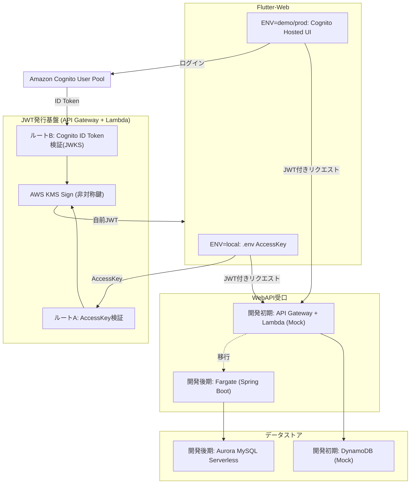
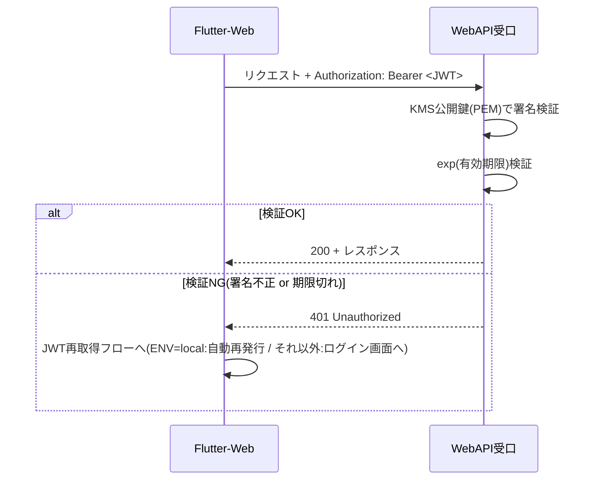

# design.md — 認証基盤(JWT / KMS / Cognito)

## 1. アーキテクチャ概要



## 2. 設計方針(トークン交換パターン)

Cognito・AccessKeyのいずれのログイン経路であっても、最終的にWebAPI受口に渡されるトークンは**KMSの非対称鍵で署名した単一形式のJWT**に統一する(トークン交換 / Token Exchangeパターン)。

これにより、WebAPI受口(Spring Boot / Lambda Mock)は発行元の違い(AccessKeyかCognitoか)を意識せず、常に1つの公開鍵で検証すればよい。マルチ発行者(multi-issuer)対応は不要とする。

## 3. コンポーネント設計

### 3.1 JWT発行基盤(API Gateway + Lambda)

**エンドポイント構成**

| エンドポイント | 入力 | 処理内容 |
|---|---|---|
| `POST /auth/token` (ルートA) | `{ "accessKey": "xxxx" }` | 事前登録リストと照合 → OKならKMS.Sign |
| `POST /auth/token/cognito` (ルートB) | `{ "idToken": "xxxx" }`(Cognito ID Token) | CognitoのJWKSで署名検証 → OKならKMS.Sign |

**KMS署名処理(共通ロジック)**

1. JWTヘッダー(`{"alg":"RS256","typ":"JWT"}`)とペイロード(`sub`, `iss`, `iat`, `exp` 等)をそれぞれBase64URLエンコードし、`.`で結合(署名対象文字列)。
2. KMS `Sign` API を呼び出す。
   - `KeyId`: 発行用KMSキーのARN
   - `MessageType`: `RAW`
   - `SigningAlgorithm`: `RSASSA_PKCS1_V1_5_SHA_256`(KeySpec: `RSA_2048`の場合)
3. 返却された署名バイト列をBase64URLエンコードし、署名対象文字列の末尾に`.`区切りで結合してJWT完成。

**AccessKey管理(ルートA)**

- ランダムな文字列(例: `openssl rand -base64 32`)を1つ以上生成し、Lambdaの環境変数・SecretsManager・またはDynamoDBの許可リストに登録する。
- 配布はアプリ外の経路(パスワードマネージャーの共有機能、社内チャットの個人DM等)で行い、リポジトリやビルド成果物には含めない。
- 監査要件がある場合は、AccessKeyをメンバーごとに個別発行し、自前JWTの`sub`にユーザー識別子を設定できるようにする(REQ-106準拠)。

**Cognito ID Token検証(ルートB)**

- CognitoのJWKSエンドポイント(`https://cognito-idp.<region>.amazonaws.com/<userPoolId>/.well-known/jwks.json`)から公開鍵を取得し、署名・`iss`・`aud`(Client ID)・`exp`を検証する。
- 検証OK後、トークン内の`sub`(または`email`)を自前JWTの`sub`クレームに引き継ぐ。

### 3.2 KMSキー設計

| 項目 | 値 |
|---|---|
| KeySpec | `RSA_2048` |
| KeyUsage | `SIGN_VERIFY` |
| 対応するJWT alg | `RS256` |
| 秘密鍵の扱い | KMS内に閉じたまま。エクスポート不可 |
| 公開鍵の扱い | `aws kms get-public-key` でエクスポートし、PEM形式に変換してWebAPI受口(Spring Boot / Lambda Mock)に配布・設置 |

同一のKMSキーを、開発初期(Lambda Mock発行)から開発後期(Fargate/Spring Boot発行に切り替えた場合)まで継続して使用可能。IAMロール(Lambda実行ロール → 将来的にFargateタスクロール)側の権限切り替えのみで対応する。

### 3.3 WebAPI受口の検証ロジック(Spring Boot / Lambda Mock 共通)



- Spring Boot側は`spring-security-oauth2-resource-server`等、標準的なJWT検証ライブラリ・フィルタを使用し、公開鍵は静的ファイル(またはSecretsManager経由)として設置する。
- Lambda(Mock)側も同一の公開鍵・検証ロジックを用いる(実装言語が異なる場合は、同等のJWTライブラリで代替する)。

### 3.4 フロントエンド(Flutter-Web)設計

**ビルドフレーバーによる分岐**

```dart
// 疑似コード: main.dart 起動時
const env = String.fromEnvironment('ENV', defaultValue: 'local');

if (env == 'local') {
  // .envからAccessKeyを取得し、ルートAへ自動送信
  final accessKey = dotenv.env['ACCESS_KEY'];
  final jwt = await authRepository.issueTokenByAccessKey(accessKey);
  await secureStorage.write(key: 'jwt', value: jwt);
} else {
  // SecureStorageにJWTがあれば再利用、なければCognitoログイン画面へ
  final existingJwt = await secureStorage.read(key: 'jwt');
  if (existingJwt == null) {
    // Cognito Hosted UIへ遷移 → ログイン成功後、Cognito ID Tokenを取得
    final idToken = await cognitoAuth.login();
    final jwt = await authRepository.issueTokenByCognito(idToken);
    await secureStorage.write(key: 'jwt', value: jwt);
  }
}
```

**HTTPクライアントのInterceptor設計**

- 全APIリクエストに共通でJWTをAuthorizationヘッダーに付与するInterceptorを実装する。
- レスポンスが401の場合、以下の再取得フローをInterceptor内(またはグローバルなエラーハンドラ)で一元的に実行する。
  - `ENV=local`: `.env`のAccessKeyで自動的にルートAへ再送信し、JWTを再取得後、元のリクエストをリトライする。
  - `ENV=local`以外: SecureStorageのJWTを破棄し、Cognitoログイン画面へ遷移する。

**環境変数・ビルドコマンド例**

| 環境 | ビルドコマンド例 |
|---|---|
| ローカル開発 | `flutter run --dart-define=ENV=local` |
| 検証環境(デモ) | `flutter build web --dart-define=ENV=demo` |
| 本番 | `flutter build web --dart-define=ENV=prod` |

`.env`はローカル開発時のみ参照され、`ENV=demo`/`ENV=prod`でビルドした成果物には`.env`由来の値を一切含めない(Assetからも除外する)。

## 4. 移行方針(Mock → 本番相当構成)

| フェーズ | WebAPI受口 | データストア | JWT検証ロジック |
|---|---|---|---|
| 開発初期 | API Gateway + Lambda(Mock) | DynamoDB | KMS公開鍵で検証(共通) |
| 開発後期〜本番相当 | Fargate(Spring Boot、コンテナ化) | Aurora MySQL Serverless | KMS公開鍵で検証(共通・変更なし) |

- JWT発行基盤(API Gateway + Lambda + KMS)自体は移行の前後で変更しない。
- WebAPI受口の実装言語・実行基盤が変わっても、検証ロジック(公開鍵検証)は同一のため作り直しは発生しない(REQ-403準拠)。
- API GatewayからWebAPI受口への接続方式は、Lambda統合 → ALB/VPCリンク経由のFargate統合へ切り替える。

## 5. 可用性方針

- JWT発行基盤(Lambda)は、既存のFargate(WebAPI本体)の障害に影響されず独立して稼働する(疎結合であることが前提設計のため、追加対応は不要)。
- Fargate(WebAPI受口)自体の可用性は、タスク数(レプリカ数)を2以上にし、ALBヘルスチェックで担保する。コンテナの分割単位(モノリシック)自体は可用性方針に影響しない。

## 6. セキュリティ設計上の留意事項

- KMS秘密鍵は非公開のまま運用し、署名は必ずKMS `Sign` APIを経由する(NFR-002)。
- AccessKeyはリポジトリ非管理とし、`.env.sample`(ダミー値)のみをリポジトリに含める(NFR-003)。
- 検証環境・本番環境では、CloudFront + WAF(IP制限またはBasic認証)を外側の防御として併用することを推奨する(別紙セキュリティ設計にて詳細化)。
- JWT有効期限は開発中30日、本番運用開始前に1〜2時間程度への短縮を別チケットで検討する。

## 7. 未決定事項・今後の検討課題(申し送り事項)

- リフレッシュトークン方式の導入要否(本番相当移行時に再検討)。
- AccessKeyをメンバー個別発行にするか、共通1つにするかの最終決定。
- WAF方式(IP制限 / Basic認証)の選定(社内メンバーのアクセス経路が固定IP/VPN経由かどうかに依存)。
- 本番環境における具体的なJWT有効期限値の最終決定。
